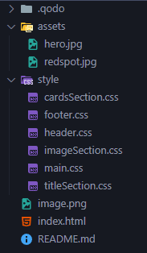

NYE FEATURES SIDEN FORRIGE ITERASJON:

Oppdateringer gjort i index.html, cardSection.css og titleSection.css:
(Trykk på utforskning i nav baren for å scrolle ned til det nye James Webb kortet)

1. Fikset kommentarer i HTML koden
2. La til en unordered list under "Utforkning og Oppdagelser" i "James Webb-teleskopet" kortet.
3. La til en stjerne etter hvert li element i "James Webb-teleskopet".
4. La til en dekorativ linje før hver section title med "::before" i titleSection.css
5. La til annen bakgrunn for annenhvert element i "James Webb-telescopet" med nth-child
6. La til annen farge på første og siste teksten i "James Webb-telescopet" ved å bruke first og last child.
7. La til .card-list li:nth-child(odd):not(:first-child), som gjør at bakgrunnen fra nth(odd) bare gis til li 3, siden li 1 har ::not.

---

CSS Advanced Oppgave 2: Using Pseudo Elements/Selectors:

Introduksjon
I denne oppgaven skal du lære å bruke pseudo-elementer og pseudo-selektorer for å legge til avansert styling i HTML-innholdet ditt. Du vil bruke både ::before og ::after samt selektorer som :nth-child, :hover, :first-child og flere.

Oppgavespesifikasjoner
Lag en webside med følgende innhold:
En hovedoverskrift (h1) som beskriver emnet (f.eks. "Lær Pseudo-elementer").
En uordnet liste (ul) med minst 5 elementer.
Et seksjonselement (<section>) med tre underseksjoner (
).
En knapp med en interaktiv handling.
Del 1: Pseudo-elementer (::before og ::after)
Oppgave 1.1: Legg til en dekorativ linje før overskriften ved å bruke ::before.
Oppgave 1.2: Legg til en stjerne etter hvert listeelement ved å bruke ::after.
Oppgave 1.3: Gi ::before og ::after forskjellige farger og størrelser.
Del 2: Pseudo-selektorer
Oppgave 2.1: Endre bakgrunnsfargen på alle ulike listeelementer ved å bruke :nth-child(odd).
Oppgave 2.2: Legg til en overgangseffekt på knappen når brukeren holder musen over den (bruk :hover).
Oppgave 2.3: Gi det første og siste elementet i listen en annen tekstfarge ved å bruke :first-child og :last-child.
Oppgave 2.4: Bruk :not() til å ekskludere et element fra styling.
Ekstra utfordring (valgfritt)
Lag en fremhevet seksjon med:

En dekorativ ::before og ::after som lager en "boks" rundt teksten.
Bruk :focus til å gi en spesialeffekt på et tekstfelt når det er i fokus.
Bruk :nth-of-type for å style én spesifikk underseksjon.
Leveringskrav
Bruk HTML og CSS-filer separat.
Lagre prosjektet i en mappe som heter pseudo-oppgave.

---

TIDLIGERE OPPGAVE:

Dere skal samarbeide i grupper på 2 om å lage en one-page nettside med en av planetene i solsystemet som tema.

Nettsiden skal ha en ganske enkel struktur: Header med en navbar som scroller til de forskjellige seksjonene. Minimum 2 seksjoner.  Forslag til seksjoner: Bildegalleri, Infoside, Faktaliste etc. Se layout mal nederst.

Fokus skal være på design og layout, valg av fargetema, valg av bilder, valg av fonter.

TIPS: 

//HTML

<section id="mysection"></section> // container element for section
 // link til navbar knappene som scroller til section
//CSS

html { 
scroll-behavior: smooth; 
}
/* Med denne får du en smooth scroll når du navigerer til section */

Dere skal planlegge design og layout i Figma. (En lager figma prosjektet og inviterer den andre til å være editor i prosjektet). Figma skissen kan enten være kun wireframe og konsept, eller full skisse (Men husk å sette av god tid til å kode ut siden!)
Siden skal kodes med HTML og CSS. Det legges vekt på god bruk av semantisk og ryddig HTML og bruk av flex-box til layout i CSS (I CSS skal du være varsom med bruk av position absolute og absolutte verdier. Spør om du er usikker på hva som menes med dette.)
Siden trenger ikke å være responsiv (dvs den trenger ikke å optimaliseres for mobil)
Dere skal samarbeide om koding med å bruke 1 GitHub repository som begge pusher og puller kode til/fra  (en lager repository og gir den andre tilgang. Dette kan vi hjelpe med.)
Husk å kommentere i koden.
Siden skal hostes på GitHub Pages (gratis hosting tjeneste, her er en quickstart guide: https://docs.github.com/en/pages/quickstartLinks to an external site.)
LYKKE TIL! 😊

Ressurser
https://unsplash.com/Links to an external site. og https://www.pexels.com/Links to an external site. er gode ressurser for lisensfrie bilder.

https://solarsystem.nasa.gov/planets/overview/Links to an external site. er en bra ressurs for bilder/informasjon.

---

MINE NOTATER:

PROSJEKT JUPITER (hvordan nettsiden vil være delt opp):

Header: logo | Jupiter, Måner, Utforskning

-

seksjon 1: Hero: fullskjerms bilde av Jupiter og tekst som sier "Jupiter: Solsystemet's hersker?"

seksjon 2: tittel: "Fakta om Gasskjempen"

seksjon 3: fire kort: "Størrelse", "sammensetning", "den røde flekken", "Hurtig rotasjon og stormer."

-

seksjon 4: emneskille med et stort bilde: Jupiters fire galileiske måner som gir en introduksjon til månene og de fire galileiske månene. (identisk til seksjon 1 med samme css)

seksjon 5: tittel: "De fire galaktiske månene" (identisk til seksjon 2 med samme css)

seksjon 6: fire kort: Io, Europa, Ganymedes, Callisto. (identisk til seksjon 3 med samme css)

-

seksjon 7: James Webb bilde 

Seksjon 8: Utforskning og oppdagelser

seksjon 9: 4 forskjellige utforskede elementer: "Søket etter Liv i Europas Skjulte Hav", "James Webb-teleskopet: Jupiters Nordlys og Jetstrømmer", "Stormen Som Ikke Vil Dø", "Hvordan Jupiter Fungerer som et Skjold"

-

Footer:
Venstre: Logo + (navn), epost: ProsjektJupiter@gmail.com, lokasjon: NASA (florida),
Høyre: kilder: link til forskjellige nettsider som informerer (Wikipedia), snl etc.

-

Nettsiden er bygd opp med en header og 3 css filer som repeteres 3 ganger: image, title, card repeat. (Samme css filene brukes for å lage seksjon 1, 2 og 3 som 4, 5, 6 og 7, 8, 9.), til slutt en footer.

-

Farger som passer til nettsiden i stil med Jupiter som legges i root:
Mørke farger: svart og mørk grå med blåtoner/ lilla toner
Kontrast/accent farger: rød/oransje, lys grå.
#0A041C, #1F1538, #FCEFD5, #70A0CC, #C95F38, #991f00
font: Poppins

Alle notatet er skrevet før jeg har begynt på index.html, og filstrukturen ser allerede slik ut uten noe kode, før jeg har startet på prosjektet:

---
